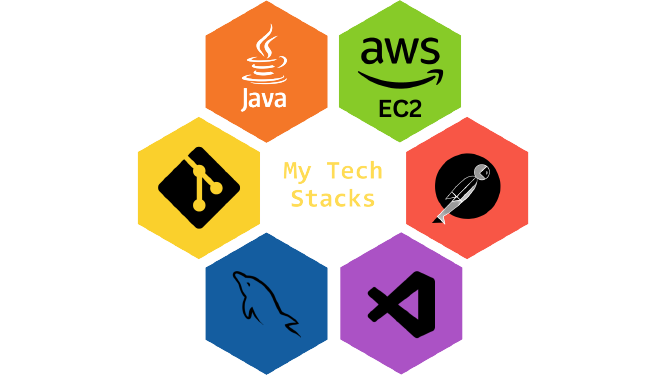

<!-- <h2 align="center">👋𝐈'𝐦 𝐏𝐫𝐚𝐦𝐨𝐝 𝐊𝐮𝐦𝐚𝐫.</h2> -->

  

<em>Backend Developer 
</em>

<!-- 
  
 -->

<h3>DESCRIPTION<h3>
<h3> "I'm a Full-Stack Developer with expertise in a wide range of technologies and tools, including Hibernate, Thymeleaf, Bootstrap, JavaScript, Java, SQL, Spring Boot, HTML, CSS, and more. I also have proficiency in design software such as Figma and Adobe Photoshop. My strong foundation in Data Structures and Algorithms (DSA) combined with a deep understanding of Object-Oriented Java allows me to create robust and efficient solutions for web development projects. Let's connect and explore how I can contribute to your next project!"</h3>
<h2>Tools Used</h2>

 
  
  
  
   
  
  
  
  
  
  
  
  

<h2 align="left">Connect with me</h2>

📄 Resume->
 
 

 
<!--  -->

 
 

